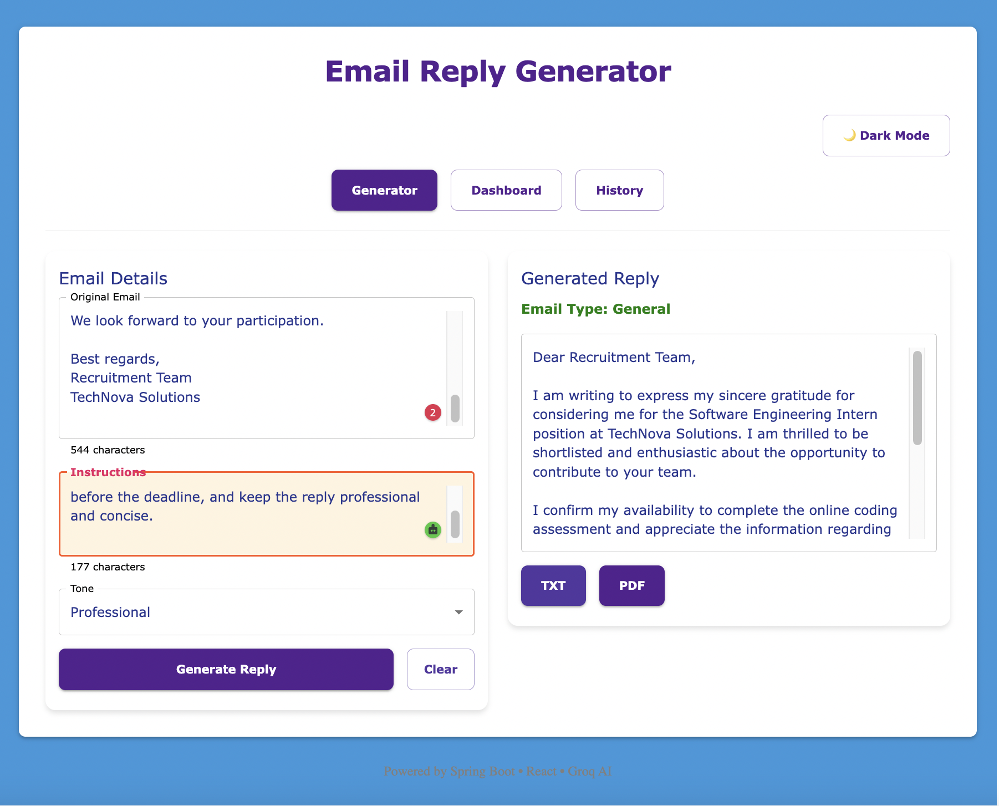

# AI Inbox Assistant


An AIML-powered email reply generation system that leverages Large Language Models (LLMs) to generate
context-aware, professional email responses. Built using Spring Boot, Groq's Llama 3.3 model, and a
Chrome Extension interface, the application analyzes email content, understands user intent, and
generates personalized replies based on selected tone and custom instructions.

## 📸 Application Demo

### AI Email Reply Generation

The user provides:
- Original email content
- Custom instructions
- Desired response tone
<p align="center">
  
</p>

## Live Demo & Deployment

- Backend API (Render Deployment): https://ai-inbox-assistant-9c6d.onrender.com
- Frontend / Extension Demo (Vercel Deployment): https://ai-email-reply-generator-gamma.vercel.app
- GitHub Repository: https://github.com/pixelpilot007/AI-Inbox-Assistant.git

## Features

- Generate AI-powered email replies
- AI-generated email replies using Large Language Models (LLMs)
- Context-aware response generation
- Prompt-based customization using user instructions
- Natural Language Understanding (NLU) for email context analysis
- Multiple tone options (Formal, Casual, Professional, Friendly, etc.)
- Email Classification (type detection)
- Dark Mode support
- Reply history tracking
- PDF export
- TXT export
- Chrome Extension integration
- Chart / Analytics Dashboard ()
- Responsive React UI
- AI-generated email replies using Groq LLM
- Custom instructions support
- REST API backend built with Spring Boot
- Dockerized deployment
- Cloud deployment on Render

## AIML Concepts & Techniques Used
- Generative AI for automated email reply generation
- LLMs (Llama 3.3) for natural language understanding and generation
- Prompt Engineering for controlling tone, style, and content
- NLP for email context and intent analysis
- Context-Aware Text Generation for relevant responses
- Instruction-Based Prompting using user-defined requirements
- Groq-Powered Inference for fast response generation
- Human-AI Interaction Design through customizable reply controls

## Tech Stack

### Frontend
- Chrome Extension
- JavaScript
- HTML
- CSS

### Backend
- Java 17
- Spring Boot 3
- Spring MVC
- WebClient
- RESTful APIs
- Maven

### Artificial Intelligence & Machine Learning
- Generative AI
- Natural Language Processing (NLP)
- Prompt Engineering
- Large Language Models (LLMs)
- Context-Aware Text Generation
- Groq API
- Llama 3.3 70B Versatile

### Deployment & DevOps
- Docker
- Render
- Vercel (Frontend Hosting)
- Git & GitHub

## API Endpoint

### Generate Email Reply

- POST /api/email/generate

### Request:

{
"emailContent": "I want to request leave for two days because of a family function.",
"tone": "Professional",
"instructions": "Keep it concise and polite"
}

Response:

TDear [Name],

I have received your request for a two-day leave due to a family function. I will review your request and get back to you shortly. Please let me know if there's any additional information I need from you to facilitate the process.

Thank you for your understanding and I look forward to responding to your request soon.

Best regards,
[Your Name]

## Example API URL
- https://ai-inbox-assistant-9c6d.onrender.com/api/email/generate

## Project Architecture

Chrome Extension
↓
Spring Boot REST API
↓
Prompt Engineering Layer
↓
Groq LLM API (Llama 3.3)
↓
AI-Generated Email Response

## Deployment

### Docker
- docker build -t ai-inbox-assistant .
- docker run -p 8080:8080 ai-inbox-assistant

### Render
- Connect GitHub repository
- Configure environment variables
- Deploy using Docker
- Access deployed API endpoint

## Challenges Solved

- Migrated from Spring WebFlux to Spring MVC to eliminate blocking-call issues.
- Dockerized the application for cloud deployment.
- Managed secure API keys using environment variables.
- Integrated Groq LLM for real-time email generation.

## Future Enhancements
- Gmail Compose Integration
- Retrieval-Augmented Generation (RAG) for personalized responses
- Multiple AI Models Support
- Email Summarization using NLP
- Sentiment Analysis for tone-aware replies
- Reply Regeneration and Optimization
- User Authentication
- Fine-Tuned Domain-Specific Email Models

## Environment Variables

Backend requires:

```env
GROQ_API_KEY=your_groq_api_key
```

## Run Frontend

```bash
cd email-writer-react
npm install
npm run dev
```

## Run Backend

```bash
export GROQ_API_KEY=your_api_key
./mvnw spring-boot:run
```
